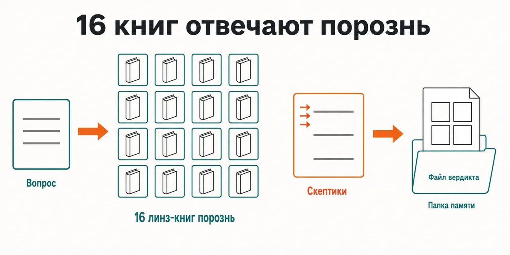
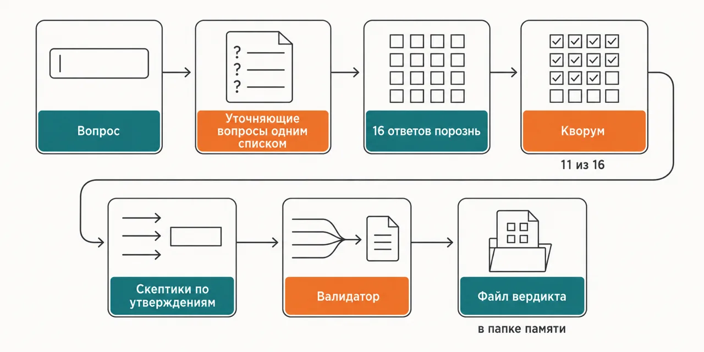

English · [Русский](README.md)

# You test the idea against the book you finished last — and it always agrees with you

Sixteen lenses each read their own book and answer separately, never seeing one another's answers,
and skeptics then go after whatever agreed or clashed: only what survives reaches "What to do".

```
claude plugin marketplace add https://github.com/beCyborg/jadlis-start.git
claude plugin install advisor-product@jadlis
```

The plugin asks for no keys and no third-party subscriptions — only a memory folder: without one the
council stops at the first step and writes nothing.



In words: on the left your question, in the middle sixteen isolated book lenses, on the right the
skeptic layer, and coming out one verdict file in your memory folder.

This is my workbench published as it is, not a product: whatever I stopped using, I removed.

## Before → after

| By hand | With an AI chat | With this plugin |
|---|---|---|
| **What the idea gets tested against.** One or two books within reach, both written about someone else's case. | It answers out of one blended pool of knowledge: you cannot tell which book said what. | Each lens reads only its own digest and answers with tags from it; the other books' knowledge never enters its answer. |
| **Where agreement comes from.** Opinions are collected one after another, and the first one frames the rest. | One frame for the whole answer — there is nothing to compare it with. | The lenses work in parallel and never see one another's answers; a curator collects the overlaps and the clashes into checkable claims. |
| **What happens to what agreed.** Several books line up, so it counts as proven. | Agreement inside a single answer is never checked at all. | Three skeptics go at every claim with orders to refute it; a majority "refuted" throws it out of "What to do". |
| **The age of the advice.** A tactic from an old book gets applied as today's. | The publication year is invisible in the answer. | Veteran lenses carry a role flag in the roster: the principles stand, the specific tools and channels are marked dead, and the validator weighs that in. |
| **What is left after the session.** The decision and its reason stay in your head. | You are left with a chat log you cannot find anything in. | The verdict lands as a file in your memory folder, a line goes into the council journal, and the session context into the council profile. |

## How it works



Going in — your question and the profile from the memory folder.
Inside — the lenses hand in their clarifying questions and you answer once for all of them; then the
fan-out, a quorum gate, a skeptic layer per claim and a single validator.
Coming out — a verdict file with a SWOT, a consensus map and a ledger column.

In words: question → the lenses' clarifying questions as one list → sixteen answers made separately →
quorum → skeptics per claim → validator → a verdict file in the memory folder.

Holding that verdict up are constraints wired into the code. A lens speaks only for its own book
and must attach a citation tag that exists in its digest — an invented tag voids the recommendation.
A verdict is issued only if at least eleven of the sixteen lenses answered; fewer, and the council
hands over the raw answers with a warning and does no synthesis. The curator picks the most decisive
claims, and three independent skeptics vote on each one: what is refuted never reaches "What to do",
what is contested moves to the "Against" side and is flagged in the consensus map. The validator is
the only one who synthesises: it weighs the lenses by relevance, specificity, agreement and their own
stated confidence, sorts the recommendations into eight product categories, and writes out a separate
section of blind spots — what you did not know and what nobody got to ask you.

Sometimes nothing survives the check. That is the answer "there are no grounds for this decision",
not a breakage: unanimity across the roster more often means one shared school or one shared framing
of the task than independent confirmation.

## Installing and the first run

**a) Text to paste to an agent.** Copy the whole thing into a Claude Code chat:

```
You are the installer. Install the plugin advisor-product from the jadlis marketplace on this Mac.
Run exactly these commands, verbatim, shortening nothing:
1. claude plugin marketplace add https://github.com/beCyborg/jadlis-start.git
2. claude plugin install advisor-product@jadlis --config MEMORY_DIR=~/advisors-memory
3. claude plugin list — show me the line about advisor-product and its version.
MEMORY_DIR is an ordinary folder on disk where the council writes verdicts, journals and
profiles; ask me which folder to use and put my answer in place of ~/advisors-memory.
Before each command show it to me in full and wait for "yes". If I say "no", do not run it,
tell me what you skipped, and move on.
If a command returns an error, stop, show me the output, and do not move to the next one.
```

**b) Commands by hand.**

```
claude plugin marketplace add https://github.com/beCyborg/jadlis-start.git
claude plugin install advisor-product@jadlis --config MEMORY_DIR=~/advisors-memory
claude plugin list
```

The first command installs nothing — it adds the marketplace. Only the second one installs, and one
line removes it: `claude plugin uninstall advisor-product@jadlis --keep-data`.

`MEMORY_DIR` is the plugin's only setting: the folder outside of which the council writes nothing at
all. Every Jadlis council can point at the same one. The folder skeleton unfolds by itself on the
first run and leaves existing files alone. Changing the path later means reinstalling: on an already
installed plugin the `--config` flag silently changes nothing (checked 2026-09-07).

**c) The short command.** Open Claude Code in the folder you work in and type:

```
/advisor-product <your product question>
```

If it is not found, check the name with `claude plugin list`. The first thing the council does is
collect the lenses' clarifying questions and put them to you as one list: your answers go to all
sixteen at once, and whatever stays unknown lands in the verdict as the "Blind spots" section.

## Limits, cost, updating

**What it does not do.** It does not go online and does not check the market: the lenses answer out of
book digests and have no access to fresh data. It does not replace a lawyer, an accountant, a
financial adviser or a doctor — this is not professional advice. It does not produce a bibliography: a
tag like `[MT:R1]` points at a block of the digest inside the plugin, not at a page of the book. It
does not make the decision for you and carries none of its consequences — a verdict is what is left
after an internal check, not a confirmed fact about the world. It writes nowhere but the memory
folder. And it is not edited here: this repository is generated from a private source and CI rejects
direct edits — spot a mistake, open an issue, and the fix ships with the next release.

**What you need.** No keys, and no third-party subscriptions either: the council runs inside Claude
Code on your own quota. You need a folder for council memory, set at install time via the `MEMORY_DIR`
key. Its contents are private — your profile, the journals and the verdicts live there — so pick the
location with syncing and backups in mind.

[уточнить] — the repository pins no minimum Claude Code version for the Workflow tool.

**How tokens get spent.** The run is heavy: dozens of subagents out of your quota — sixteen lenses for
the clarifying questions, sixteen for the analysis, a curator, three skeptics per claim under test,
and a validator. An exhausted session window takes down the whole fan-out rather than part of it: the
lenses come back refusing, quorum is not reached, there is no verdict. So check what is left of the
window before you start, not after; several councils back to back do not fit into one window. This is
a tool for questions you do not get to replay.

**Verified where I work:** my Mac, my subscription. Where else this works — [уточнить].

**Terms of use.** There is no license: all rights reserved by the author. You may read it and use it
personally. Commercial use, republishing and bundling it into your own products — by arrangement
with me.

The book digests are derivative works with limits of their own, set out in `NOTICE.md`.

**Updating.** With a third-party marketplace, auto-update is off on your side: until you run the
first command you keep the version you installed.

```
claude plugin marketplace update jadlis
claude plugin update advisor-product@jadlis
claude plugin list
```

Reinstall, if something ended up crooked:

```
claude plugin uninstall advisor-product@jadlis --keep-data && claude plugin install advisor-product@jadlis
```
